# Relay

**A procurement proxy for applications and agents that need to retrieve or buy data.**

Relay brings source selection, spending controls, payment and delivery evidence into one workflow. Its first implemented scenario is a lender requesting additional business-registration or industry-income context. The institution retains responsibility for lending decisions.

**Current status: local hackathon prototype.** The main procurement flow uses real **XRPL Testnet** payments and sample data. The wallet workspace uses real signatures with **offline simulated settlement**. Procurement decisions are deterministic policy rules; no LLM interprets customer goals or selects suppliers.

## What you can run

| Component | Entry | Current behavior |
| --- | --- | --- |
| Procurement terminal | [Live Shopping](http://127.0.0.1:8000/) | Customer checkout → source selection → x402 payment → sample receipt and acceptance checks |
| Policy Config | Dashboard tab or `/policy-config` | Read-only category, trust, freshness and spending rules |
| Audit Ledger | Dashboard tab or `/audit-ledger` | Candidate decisions, payment records and delivery status; dashboard adds acceptance details; JSON and CSV exports |
| Wallet workspace | [Wallets](http://127.0.0.1:8000/wallets) | Create independent child wallets with budgets, allocate simulated funds, buy samples and recover a lost response using the same transaction |
| Product presentation | [v4 deck](relay-business-deck-v4.html) | Product proposition and proposed commercial model; includes capabilities beyond the implemented prototype |

Localhost links require the backend on your own machine. This repository does not provide a public hosted application.

**Local work in progress:** the development workspace also contains a `credit-card-market/` Mock and a `USER-001` dashboard entry. They demonstrate consent, questions over synthetic spending data, simulated payments, contributor earnings and refunds. They remain uncommitted at this README update and are **not included in a fresh clone**. They do not connect to the main Testnet checkout, wallet engine or audit ledger. The concise v4 deck and page-flow demo are also local, uncommitted artifacts.

## Quick start

Requires Git, Python **3.11+** (locally verified with 3.12), and internet access for installation and Testnet operations.

```sh
git clone git@github.com:geekysong/demo.git
cd demo
python3.12 -m venv .venv
.venv/bin/python -m pip install -r requirements.txt
.venv/bin/python setup_testnet.py
sh start.sh
```

If already checked out, start with the virtual-environment step. Use an installed Python 3.11+ executable if `python3.12` is unavailable. Repository access is required for SSH cloning.

`setup_testnet.py` creates disposable buyer and merchant Testnet wallets when `.env` is absent, funds inactive accounts through the faucet, and preserves existing configuration. Seeds stay in the ignored `.env`; a newly created file has owner-only permissions. It does **not** create or fund your browser wallet.

Open [the dashboard](http://127.0.0.1:8000/) and:

1. Select a data product.
2. Complete customer checkout using a funded Testnet wallet or the **mock card** flow.
3. Click **Run paid procurement**. Even when customer checkout is mocked, the supplier purchase still uses real Testnet XRP.
4. Inspect the selection explanation, quote, transaction and separate data-acceptance result.
5. Open Audit Ledger for the recorded evidence.

For subsequent starts, run `sh start.sh`. It binds to `127.0.0.1:8000`. Run one backend instance per checkout database and one procurement at a time.

To use another port, keep the backend and mirror self-URL aligned:

```sh
RELAY_SELF_URL=http://127.0.0.1:8001 .venv/bin/python -m uvicorn orchestrator:app --host 127.0.0.1 --port 8001
```

See [local setup](LOCAL_SETUP.md) and [checkout details](CHECKOUT_DEMO.md).

## Main procurement flow

```mermaid
flowchart LR
    A[Structured request] --> B[Customer checkout]
    B --> C[Unpaid source probes]
    C --> D[Policy filter and selection explanation]
    D --> E[Final 402 quote checks]
    E --> F[Sign and settle on XRPL Testnet]
    F --> G[Independent payment confirmation]
    G --> H[Sample delivery and acceptance checks]
    H --> I[Receipt and audit evidence]
```



Discovery probes two configured vendor endpoints, with labeled fallback declarations when unavailable. It does not dynamically search the entire marketplace. Eligible candidates are ranked by lowest price, with stable input order breaking ties. The decision record explains this rule and preserves the request, policy and candidate evidence.

Before signing, Relay checks the final quote's scheme, network, asset, recipient, exact price and spending limits. It disables redirects on the mirror purchase requests. Independent chain confirmation checks validated success, payment type, payer, recipient and exact delivered amount, rejecting partial payments.

### Payment success is separate from data acceptance

| Product | Delivered sample | Acceptance under the default request |
| --- | --- | --- |
| CompliancePulse · Global LEI lookup | Stored legal-entity registration sample | `unknown`: source authenticity and observation time are not verified |
| MacroPulse · BLS wage benchmarks | May 2023 US legal-services wage sample | `rejected`: historical data fails the 30-day freshness requirement |

The validator reports category, required fields, region, freshness and provenance checks. It does not independently certify source authenticity; **none of the current samples qualifies for fully accepted delivery**.

- `payment_status=confirmed` means the expected supplier payment was independently confirmed.
- `validation_status=unknown` or `rejected` describes the data result, independently of payment.
- `phase=delivery_needs_review` is the expected outcome for current samples after confirmed payment.
- `phase=delivered` is reserved for confirmed payment **and** accepted data.
- An uncertain payment remains `unknown` / `settlement_unconfirmed`; it is not proof of non-payment.

Confirmed supplier spend still counts toward the applicant cap when acceptance fails. No automatic refund, payment reversal or operational human-review queue is implemented.

## What is real and what is simulated

| Area | Implemented scope |
| --- | --- |
| Customer wallet checkout | GemWallet or manual transaction verification; **0.10 test XRP**, plus network fee; recipient, destination tag, amount and hash-reuse checks |
| Customer card checkout | **USD 0.50 mock**, with success, decline, retry and cancellation; no processor or real card collection |
| Supplier payment | **20,000 drops / 0.02 test XRP** to a local mirror merchant through x402; real signatures and Testnet settlement |
| Original vendors | Declarations advertise Mainnet `xrpl:0`; Relay pays the local `xrpl:1` mirrors, not those vendors |
| Data and trust | Stored/synthetic demonstration data; candidate trust and endpoint freshness are demo proxies, not verified data quality |
| Wallet workspace | Real keys, signatures and x402 SDK; ledger, merchant, balances, reserves and fees are simulated; hashes are not public explorer receipts |
| Platform economics | Checkout prices are demo alternatives, not a live exchange-rate quote; no FX, RLUSD/USDT settlement or contributor payouts |

A previously recorded supplier payment of 20,000 drops is available in the [Testnet explorer](https://testnet.xrpl.org/transactions/B92C9FC50F57E81F0814B46E55A9E59AE789DDABB73E2A8484C1D7EB8318C138). Its historical `delivered` status predates the current acceptance checks. It demonstrates payment and sample retrieval, not successful validation of applicant data.

The legacy `billing.py` model uses a 17.5% fee and nominal USD 50 trial credit. Customer-checkout orders bypass it; current samples requiring review do not add a legacy platform fee. Presentation pricing and this legacy ledger are not reconciled production accounting.

## Wallet workspace

Visit `/wallets` after starting the backend. **Run full flow** demonstrates a master wallet funding two child wallets, sample purchases and a deliberately lost delivery response. **Recover same transaction** retrieves the response without a second charge.

You can also create additional unique `agent-…` wallets with individual purchase budgets of **0.02–1 XRP**. Funding and purchase authorization are separate. Sessions persist across refresh; a new session preserves previous experiments.

This workspace is isolated from the live Testnet buyer, customer checkout and billing records. See [wallet visualization](WALLET_VISUALIZATION.md) and [wallet engine](wallet_lab/README.md).

## API

Default `POST /run` requires a paid checkout bound to the selected product. A minimal sequence is:

| Step | Request | Body |
| --- | --- | --- |
| Create mock checkout | `POST /checkout` | `{"method":"fiat","data_type":"business_registration_status"}` |
| Simulate customer payment | `POST /checkout/{id}/mock` | `{"outcome":"paid"}` |
| Start supplier procurement | `POST /run` | `{"checkout_id":"<id>","data_type":"business_registration_status","applicant_region":"US","freshness_requirement_days":30}` |
| Inspect progress | `GET /status` | — |
| Inspect customer order | `GET /checkout/{id}` | — |

**Step 3 spends Testnet XRP.** For policy checks without payment, use `POST /run` with `{"scenario":"over_cap"}`, `{"scenario":"blacklist"}` or `{"scenario":"no_candidate"}` instead.

Other read endpoints: `/health`, `/marketplace/candidates`, `/policy.json`, `/billing`, `/audit` and `/audit.csv`. Audit JSON and CSV include decision, quote-check and acceptance evidence. `/status` is the current global run, not a per-ID task endpoint.

A paid checkout starts one procurement; repeating its request returns the original request ID. Competing runs are rejected without consuming the second paid checkout. This does not provide complete supplier-payment recovery after a process failure.

## Validation and limitations

Run the offline tests from the repository root:

```sh
.venv/bin/python -m unittest test_procurement_checks test_customer_checkout test_marketplace test_wallet_visualization -q
.venv/bin/python -m unittest discover -s wallet_lab -q
```

The integration verification recorded **21 main-flow tests and 16 wallet-engine tests passing**. Tests mock networking and transfer no funds. Dashboard script syntax and the paid-but-rejected receipt were also checked using a read-only browser fixture. This is not a fresh live Testnet rehearsal or verification of the GemWallet extension approval flow.

Current boundaries:

- Single-user local service: no tenant authentication or production access control; checkout/session IDs act as bearer capabilities.
- Global run state, supplier spend counters and legacy billing are in memory. Checkout records persist in `.checkout.sqlite3`; audit records in `audit_log.jsonl`; simulated wallet sessions in `.wallet-visualization/`. These runtime paths are Git-ignored.
- Policy configuration is read-only. LLM goal interpretation, category-specific freshness policies, certified provenance and live applicant verification are not implemented.
- Main supplier flow lacks persistent unknown-payment reconciliation and automatic delivery recovery. The offline wallet engine demonstrates recovery separately.
- Real card processing, automatic refunds, seller onboarding/payouts and production accounting are not implemented.

If a sample requires review, inspect its checks rather than repeat the purchase. If payment is uncertain or a process was interrupted, reconcile the existing payment before starting another purchase. For `HTTP 402` from `/run`, complete checkout first. For Testnet funding/RPC errors, check `.env` configuration and network access; never publish wallet seeds.

## Project map and supporting material

| Path | Responsibility |
| --- | --- |
| `orchestrator.py` | FastAPI app, mirror endpoints, procurement, state and audit exports |
| `customer_checkout.py`, `customer-checkout.html` | Customer wallet/mock checkout and persistent order records |
| `marketplace.py`, `policy_filter.py` | Source declarations, fallback samples and deterministic selection |
| `procurement_checks.py` | Decision evidence, final quote binding, chain confirmation and data checks |
| `relay-screen1-live.html` | Procurement terminal, policy display and audit dashboard |
| `wallet_visualization.py`, `wallet-visualization.html`, `wallet_lab/` | Isolated interactive wallet simulation |
| `billing.py` | Legacy demonstration billing model |
| `docs/ripple/`, `skills/xrpl-agentic-resources/` | Imported challenge requirements, reference snapshots and developer context pack |
| `tools/xrpl-feedback/` | Bundled feedback tooling; inactive, with no automatic submission configured |

Start with [submission guide and architecture](SUBMISSION.md), [marketplace details](MARKETPLACE_TESTNET.md), [checkout guide](CHECKOUT_DEMO.md), and [wallet guide](WALLET_VISUALIZATION.md). [Ripple integration notes](docs/ripple/INTEGRATION.md) record the imported revision and feedback setup boundaries. Reference snapshots require refresh before use as live network facts.

The [v4 presentation](relay-business-deck-v4.html) is the latest committed product deck; [v3](relay-business-deck-v3.html), [v2](relay-business-deck-v2.html) and the [original](relay-business-deck.html) are retained for history. Download/open the HTML locally to view slides; GitHub shows their source. The deck describes product direction, not a checklist of implemented capabilities.

[Data-contract design](RELAY_DATA_CONTRACT_DESIGN.md), [judge-feedback design](RELAY_JUDGE_FEEDBACK_DESIGN.md), [PRD gap plan](relay-prd-v2-gap-execution-plan.md) and [historical audit](README_AUDIT.md) contain proposals and earlier observations. Use this README and current code for implementation status.
