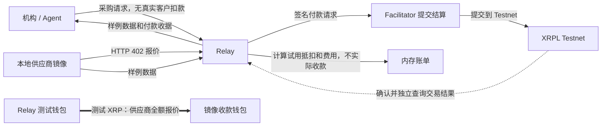
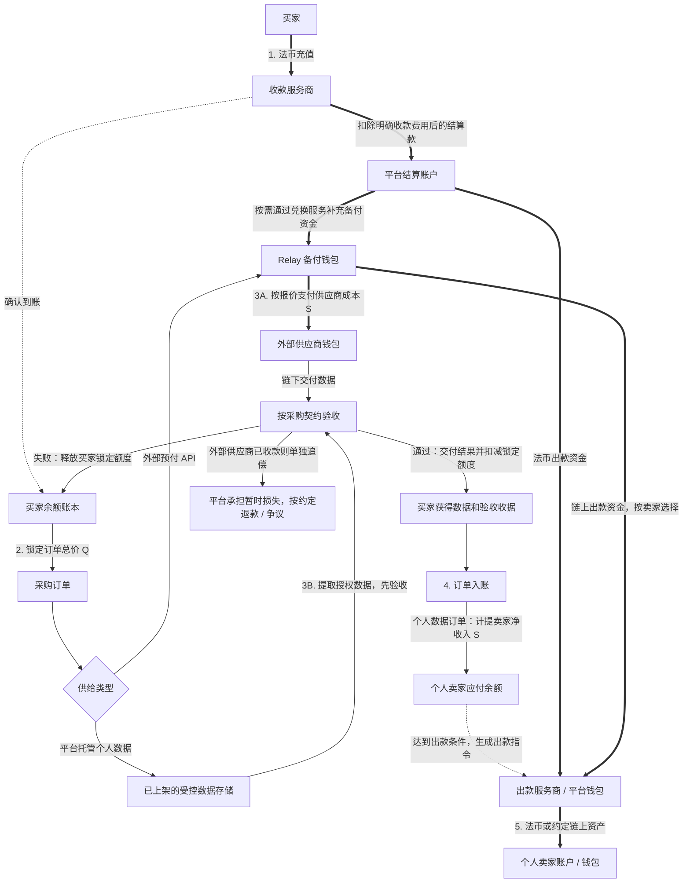
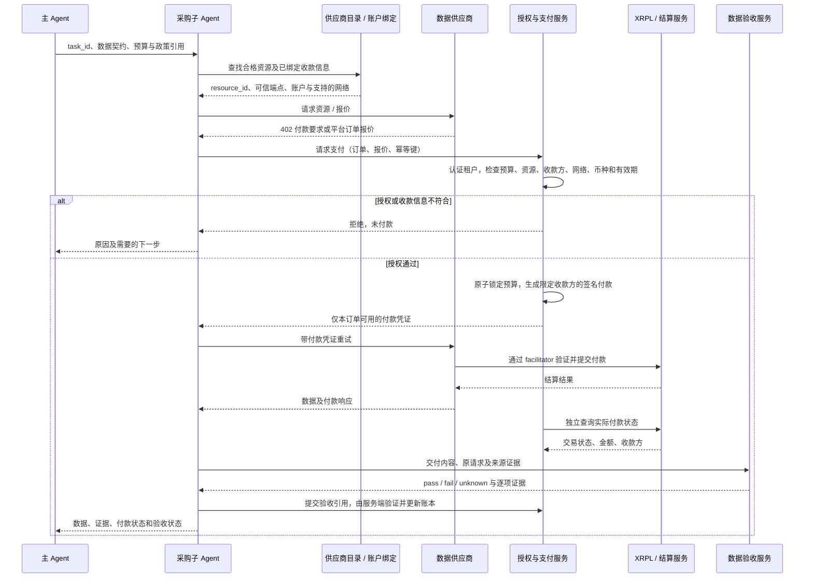

# Relay：评审反馈后的产品补齐

本文是产品设计提案，不代表功能已经实现。个人数据“放款”在这里理解为个人发布小数据后获得销售收入，不是向个人发放贷款。

建议主张：**Relay 让机构和 Agent 购买有证据、符合请求的数据，也让个人把有价值的小数据变成可出售的数据产品。**

## 1. 买家为什么相信数据

不能保证所有信息绝对真实。Relay 应承诺：明确检查什么、给出核验证据，并对未通过约定验收的数据停止计费或进入明确的补偿流程。

`valid` 必须相对于采购契约定义：买的是什么指标、哪个对象、什么时间、什么范围、允许什么用途，以及需要什么级别的来源证据。

| 买家的问题 | 拟议检查 | 展示给买家的内容 |
| --- | --- | --- |
| 谁提供的？ | 核验供应商身份、来源访问权限和发布授权；商家和个人都适用 | 发布者、来源类型、核验方式和时间；身份已核验不等于内容真实 |
| 内容有何依据？ | 优先原始来源连接、可核验原始凭据；按需要独立交叉核对 | 证据引用、核验方、方法，以及无法核验的部分 |
| 是我需要的数据吗？ | 检查对象、指标、地区、粒度、单位、字段和覆盖范围 | 请求值与交付值的逐项比较 |
| 还有效吗？ | 分别检查观测时间、发布时间和过期规则 | 具体时间、有效期和检查结果 |
| 可以用于我的任务吗？ | 对照发布者授权和买家采购用途 | 允许用途、保存期限、再分发限制 |
| 出错怎么办？ | 按预先约定的规则拒收、重试、退款或争议处理 | 验收状态、争议期限、承担损失的一方 |

每个检查返回 `pass / fail / unknown`。任何必需检查为 fail 或 unknown 都不能自动完成采购验收；不能用总分抵消硬性失败。

来源展示使用有范围的标签，例如“来源账户已连接”“原始凭据已核对”“独立来源已交叉核验”“用户自述”。不要把这些标签合并成无解释的“可信度 95%”。同一文件可能来自真实账户，但其中某个主张仍未被证明。

签名和摘要支持来源认证与完整性，付款收据证明付款；它们不能独自证明事实为真。LLM 可以辅助提取和解释，不能凭判断签发真实性证明。

**例子：**“本人过去 7 天在某类商店的消费汇总”。在获得授权后核对原始记录、金额、日期、重复记录，再生成汇总；买家收到检查范围和证据引用。若只有用户手填数字，就标为自述，不满足要求原始凭据的订单。去掉姓名也不意味着已经无法识别个人，应进一步控制精度、可见字段和购买用途。

## 2. 当前 Demo：实际的钱流向哪里

依据 `orchestrator.py`、`billing.py` 和 `MARKETPLACE_TESTNET.md`。下面只描述已有实现。

Facilitator 提交付款，不是图中另一个收款人。测试 XRP 没有实际销售收入含义。链上已付供应商全价，平台费来自另一侧客户账单计算，不是从已付供应商金额中自动抽取。

当前限制：没有真实客户法币收款、自动兑换或个人卖家提现；交付状态依据付款确认，尚无完整数据质量验收。代码采用成本加 17.5% 的演示账单及固定换算约定，v3 deck 使用另一套 $0.50 定价和汇率假设；商业演示前应统一口径，不能将两者拼成同一笔实际交易。

## 3. 拟议商业流程：客户收款、供应商付款、个人出款

推荐先用客户预付采购额度，平台自有资金备付供应商钱包。预付只是余额入账，不等于每笔订单已确认为收入。下图中的收款、内部账本、提现均待实现；图示是产品资金模型，不是支付服务商或托管架构已获确定的声明。

粗箭头代表资金移动，普通箭头代表业务步骤或数据流，虚线代表确认或出款指令。资金账户与余额账本不是同一个东西。法币出款和链上出款是备选路径，同一笔卖家应付款只能核销一次。

- 买家总价 `Q`、供应商成本/个人卖家净收入 `S`、平台毛差额 `Q − S` 分开披露；毛差额还需覆盖验证、支付、兑换、失败和运营成本，不等于净利润。
- 示例仅用于说明分配：客户支付 $0.10，其中卖家净收入 $0.07，平台毛差额 $0.03。不是已验证的价格或成本模型；报价需要说明支付费用由谁承担。
- 对外部 x402 API，供应商可能先收款再返回数据。不能声称“验收后才付供应商”或“失败自动撤回链上付款”。采用买家验收保障时，损失先由 Relay 承担，再按供应商约定追偿。
- 对平台托管的小数据，可先验证已上传内容，订单验收通过后再计提卖家收入；这与外部 API 的先付款交付模式不同。
- 卖家收入先累计，再按金额门槛或周期合并出款；每笔小额收入都有账本记录，无需每卖一条都完成法币提现。即时链上出款是否划算需实测。
- 分开维护付款、验收、买家计费、卖家应付和出款状态。支付超时先查交易再决定是否重试；以订单与幂等键防止重复扣款、重复计提和重复出款。

## 4. 个人小数据：需要一个真正的供给入口

建议增加 **Sell a data point** 页面，个人不需要部署 API，Relay 负责把符合模板的数据发布成可被 Agent 购买的资源。

首个产品可以选择：**带可核验凭据的个人消费类别汇总**。买家假设是需要消费样本的研究 Agent，须验证付费意愿。不要默认贷款申请人必须出售数据，或把购买行业样本说成已经核验申请人收入。

上架不会自动获得收入：需要真实买家购买。可以先发布明确的买家需求或悬赏，让个人提交符合需求的记录；针对同一研究样本做去重，避免无需求上传和重复样本刷收入。数据集若需多个贡献者，必须先定义可解释的收入分配规则。

最小产品需要四个页面：

1. **发布页**：模板、原始凭据、数据来源、待售字段预览、允许用途、定价及收款信息。
2. **商品页**：覆盖范围、观测时间、验证标签及其证据、价格和许可；只显示脱敏预览，避免未付款即泄露完整内容。
3. **订单页**：买家条件、验收结果、数据访问和购买收据；查询、下载及卖家收入计提都要有权限控制。
4. **收入页**：成交、待结算、可提现、已出款、争议记录；撤销上架停止后续销售，不能承诺收回买家已下载的内容。

个人数据及原始凭据存于受控链下存储；公开链上不写个人内容或可直接关联个人的标识。平台保留核验证据不代表向所有买家公开原始凭据。先约定保存、访问和删除规则，再开放销售。

## 5. 下一轮 Demo 的验收目标

建议演示一个完整订单和一个明确失败订单，仍用合成个人数据及 Testnet：

- 个人上传一条演示记录，完成来源标记、出售字段预览、授权和定价；商品可被采购接口发现。
- 买家提出明确的数据要求；系统拒绝一条过期或无法证明来源的记录，不付款、不计卖家收入。
- 买入合格演示记录，展示逐项验收结果；分别显示买家费用、卖家应付收入、平台毛差额和 Testnet 出款收据。
- 重复请求不重复计费或出款；付款失败不会显示“已收款”；外部 API 付款成功但数据失败要显示两种独立状态。

讲解顺序：先展示个人提供什么、买家为何愿意买；再展示凭什么可信；最后沿资金图解释谁付给谁、何时计费以及失败谁承担损失。

一句话 pitch：**Individuals publish small, verifiable data products. Agents buy what they need. Relay checks the evidence, delivers the data, and handles payment to the contributor.**

## 6. 技术可行性：采购子 Agent 与收付款账户

子 Agent 是采购执行者，不必是资金所有者，也不必拥有独立钱包。MVP 建议由 Relay 托管付款能力，每个采购任务获得限额授权；实际签名由隔离的支付服务完成，私钥不进入模型上下文。

| 角色 | 账户或标识 | 职责 |
| --- | --- | --- |
| 买家 | 机构账户、预算余额 | 提供采购额度和预先批准的政策 |
| 主 Agent | 任务 ID、买家身份 | 定义需要的数据和预算，派发子任务 |
| 采购子 Agent | 有期限、限定任务的权限凭证 | 发现候选、请求报价、申请付款、取回数据；不持有私钥 |
| Relay 支付服务 | 备付钱包、订单账本 | 独立校验授权、锁定预算、签名、核对链上付款和对账 |
| 外部供应商 | 已绑定的收款地址与资源身份 | 报价、收款、按约定交付 |
| 平台个人卖家 | 平台卖家 ID、已绑定出款账户 | 发布数据、累计应付收入并接收出款；不必自己运行 API |

这张时序图展开外部预付 API 路径。平台托管的个人数据沿第 3 节的内部订单路径计提卖家收入，再单独出款，不假装个人卖家都支持 x402。

### 收款账户如何确定

- 外部 API 的付款要求可以给出收款信息，但未知网站返回一个地址不足以证明它属于目标供应商。接入时将资源端点、供应商身份、收款地址、网络、币种和必要的路由标识绑定；钱包控制权证明也不等于商家真实身份已验证。
- 支付服务将实际报价与已批准绑定核对。换地址、换网络或重定向到新端点不能由子 Agent 自行接受，应重新走接入核验；未核验候选只返回待审核。
- 个人卖家在平台绑定提现账户。平台验证账户归属及所需出款信息，订单按卖家 ID 记应付账，再由出款服务使用该绑定；不从上传内容或聊天文本中提取一个地址直接付款。

### 自动执行的最小约束

授权至少绑定 `tenant_id`、`task_id`、`order_id`、资源、收款方、网络、资产、单笔上限、任务总预算和到期时间。由服务器派生或验证这些值，不相信子 Agent 自报的权限。并发子任务共享原子预算锁，避免每个子任务都以为还有同一笔余额。

子 Agent 可调用受限工具，例如 `find_resources`、`get_quote`、`request_payment`、`fetch_paid_resource`、`validate_delivery`、`get_order_status`。这些是拟议工具名，尚未实现。任意 URL 访问应限制在已批准端点，供应商返回内容始终作为数据处理，不能变成更改付款政策或访问私钥的指令。

付款超时进入 `payment_unknown` 并先查账，不能立即重新签一笔付款或释放预算。验收服务提交可验证的验收结果，账单服务不能仅凭子 Agent 声称“成功”就收费。付款和数据状态分别保存，例如 `payment=confirmed` 与 `validation=rejected` 可以同时存在。

### 先证明哪一种可行性

先实现一个主 Agent 派发一个采购子任务，从一个已接入 API 完成报价、限额付款、验收及回传。这不要求多个 LLM 实例；有状态的受控工具工作流已经可以承担采购子 Agent 的职责。

随后验证两个子任务并发时不超预算、支付响应丢失不重付、收款地址被替换会拒绝、交付失败不被误记为验收成功。任意网站上的任意数据自动购买需要逐个处理认证、报价和交付协议，不能由当前 x402 演示推断已经支持。
