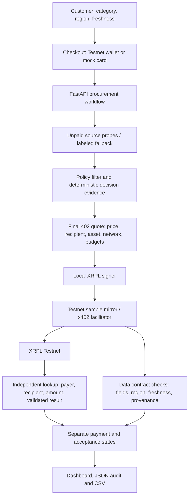

# Relay — submission guide

Relay is an on-demand data procurement workflow for lenders: a customer identifies a missing data category, pays for a demo sample, and Relay selects an eligible source, pays a local mirror through x402 on XRPL Testnet, receives the sample and reports acceptance evidence.

## Customer value and commercial model

One integration handles source selection, purchasing controls and payment receipts. Lending decisions remain with the institution. The prototype runs a deterministic policy workflow; it does not yet use an LLM to interpret free-text goals. Removing automated purchasing would require the customer to handle each supplier's quote and payment manually.

Customer checkout currently offers 0.10 test XRP or a mock USD 0.50 card payment. Supplier mirrors charge 20,000 drops. These are demonstration prices, not validated unit economics or a live FX conversion. The separate legacy billing model uses a 17.5% fee; it is not applied to customer-checkout orders. Supplier spend remains recorded if payment succeeds but data acceptance fails. No automatic customer refund or reversal of an XRPL payment is implemented.

## Architecture



Original vendor declarations advertise Mainnet. Relay purchases only configured local Testnet mirrors. No XRPL EVM Sidechain, MPP or AI Starter Kit integration is claimed. `wallet_lab` remains a separate offline simulation with real signatures.

## Reproduce and demonstrate

1. Follow [local setup](LOCAL_SETUP.md) and [checkout instructions](CHECKOUT_DEMO.md). Start with `sh start.sh` and open `http://127.0.0.1:8000/`.
2. Choose business registration status or industry income benchmarks, complete checkout, then run procurement.
3. Show selected supplier and deterministic decision explanation. Trust and endpoint freshness are labeled demo proxies.
4. Show the final quote check and a real Testnet receipt from that run. Never present a unit-test fixture hash as a real transaction.
5. Show data acceptance separately: the stored LEI sample has unverified provenance/observation time, so acceptance is `unknown`; May 2023 wages fail a 30-day requirement, so acceptance is `rejected`. Both may have confirmed payment and phase `delivery_needs_review`.
6. Open Audit Ledger to inspect acceptance checks, or download `/audit.csv` for decision, quote and validation evidence.
7. For no-payment guardrail demonstrations, POST `/run` with `{"scenario":"over_cap"}`, `{"scenario":"blacklist"}` or `{"scenario":"no_candidate"}` while no procurement is running.

The `delivered` terminal phase is reserved for confirmed payment and accepted data. The current validator intentionally never certifies source authenticity; all current samples require review. These are sample-delivery and payment demonstrations, not live applicant verification. Human review is represented by status, not an implemented reviewer queue.

An earlier recorded Testnet payment is linked in [README](README.md#what-is-real-and-what-is-simulated). It predates the new acceptance checks; this integration was tested offline and did not produce a new on-chain payment.

## Verification

From demo:

```sh
.venv/bin/python -m unittest test_procurement_checks test_customer_checkout test_marketplace test_wallet_visualization -q
.venv/bin/python -m unittest discover -s wallet_lab -q
```

Integration checks cover quote substitution blocked before signing, exact on-chain payment binding, expired sample rejection, unknown provenance and paid-but-rejected outcomes without adding a legacy platform fee. Tests mock network responses and do not transfer funds. Main dashboard JavaScript syntax and the paid/rejected receipt were also checked in a browser using a read-only local fixture.

## Submission checklist

Based on the checked-out [challenge requirements](docs/ripple/README.md), not a fresh check of the live competition rules:

- [x] Product overview, source code and setup instructions included.
- [x] Architecture and agentic payment flow explained.
- [x] Historical Testnet receipt linked; current sample limitations disclosed.
- [x] Decision, spending safeguards, payment and acceptance evidence exposed.
- [ ] Confirm repository is public and accessible to judges (visibility was not changed).
- [ ] Rehearse checkout and capture a fresh Testnet transaction and acceptance result.
- [ ] Validate target customer demand and reconcile commercial pricing assumptions.
- [ ] Enable builder feedback after receiving real name, team name and explicit submission authorization.
- [ ] Submit the final feedback form referenced in the upstream challenge README.

Builder Feedback is 10% of the rubric in the imported challenge snapshot. [Feedback tooling](tools/xrpl-feedback/INSTALL.md) is bundled but inactive; no hook registration, identity configuration or external feedback submission was performed. The upstream example about a faucet error is not evidence of an error encountered by this project.

See [resource provenance and integration notes](docs/ripple/INTEGRATION.md). RLUSD, MPP and additional wallet integrations remain future options.
